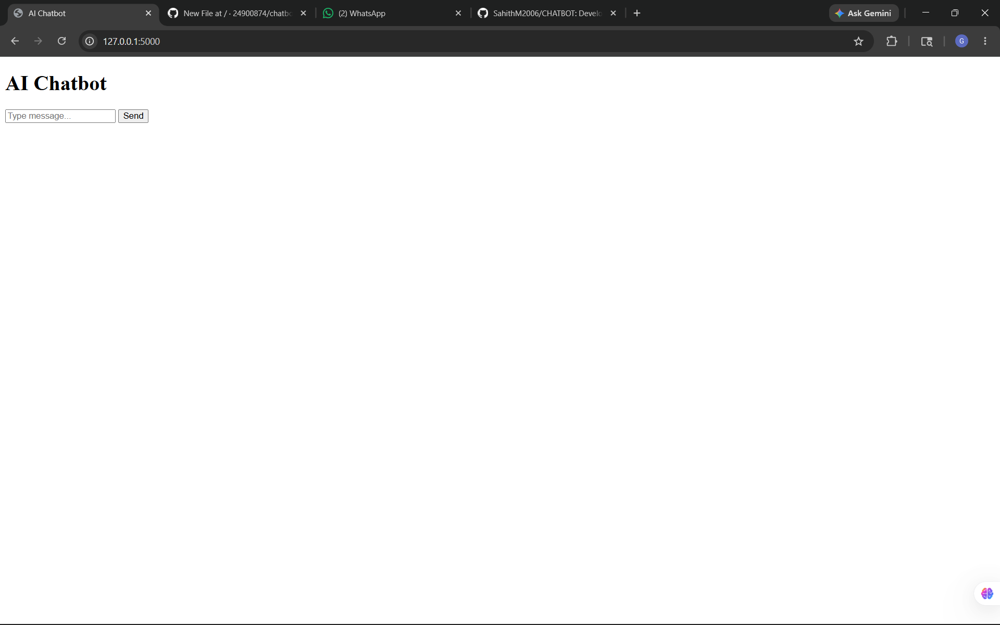
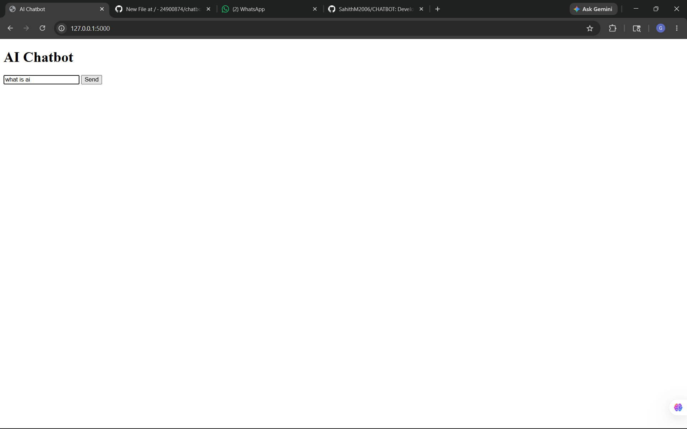
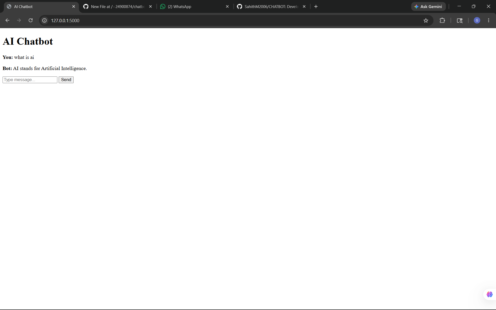
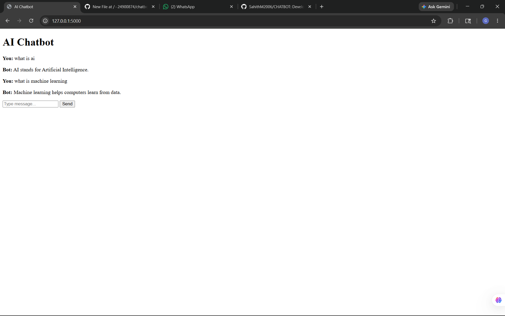

# Intelligent Enterprise Assistant – AI-Powered Organizational Support System

## Overview

The **Intelligent Enterprise Assistant** is an AI-driven chatbot platform developed to enhance organizational efficiency in large enterprises and institutions. The system integrates **Artificial Intelligence (AI)**, **Natural Language Processing (NLP)**, **Deep Learning**, and **Document Intelligence** to provide employees with instant support for HR services, IT assistance, company policies, announcements, and document analysis.

The platform functions as a smart virtual assistant capable of understanding natural language queries, retrieving contextual information, summarizing uploaded documents, and maintaining secure communication through authentication mechanisms.

---

# Key Features

## AI-Powered Chatbot

- NLP-based conversational assistant
- Context-aware intelligent responses
- Multi-turn conversation support
- HR and IT support handling
- Real-time response generation

---

## Document Intelligence

- PDF and DOCX upload support
- OCR-based text extraction
- AI-powered summarization
- Keyword extraction
- Smart document analysis

---

## Secure Authentication

- Email OTP verification
- JWT Authentication
- Role-Based Access Control
- Secure session management

---

## Content Moderation

- Offensive language filtering
- Toxicity detection
- Custom moderation system

---

## Scalability & Performance

- Multi-user support
- Optimized response handling
- Fast backend processing
- Efficient cache management

---

# Technology Stack

## Frontend

- React.js / Next.js
- HTML5
- CSS3
- Tailwind CSS
- Material UI

---

## Backend

- Flask / FastAPI
- Python
- REST APIs

---

## AI & NLP

- LangChain
- HuggingFace Transformers
- Sentence Transformers
- Retrieval-Augmented Generation (RAG)

---

## Database & Storage

- PostgreSQL / MongoDB
- Redis Cache
- FAISS / ChromaDB / Pinecone

---

## Security

- JWT Authentication
- Email OTP Verification
- Role-Based Access Control

---

# System Modules

## 1. Enterprise Chatbot

Handles employee queries related to:

- HR policies
- Leave management
- Payroll support
- IT troubleshooting
- Internal procedures
- Company announcements

---

## 2. Document Processing Engine

Processes uploaded documents to:

- Extract text
- Generate summaries
- Identify keywords
- Analyze organizational data

---

## 3. Admin Dashboard

Allows administrators to:

- Upload knowledge base documents
- Monitor chatbot activities
- Manage users
- View analytics and reports

---

# Workflow

1. User logs into the platform securely.
2. User interacts with the AI chatbot.
3. NLP models analyze the query.
4. Relevant information is retrieved from the knowledge base.
5. AI generates contextual responses.
6. Uploaded documents are analyzed and summarized.
7. Moderation layer filters inappropriate content.

---

# Objectives

- Improve organizational productivity
- Reduce HR and IT workload
- Provide instant employee assistance
- Enhance document accessibility
- Ensure secure communication

---

# Future Enhancements

- Multilingual support
- Voice assistant integration
- AI-powered ticketing system
- Mobile application support
- Advanced analytics dashboard
- ERP integration

---

# Output Screenshots


## Chatbot Interface



---

## Document Upload Module

_

---

## AI Response Output


---

## Admin Dashboard


---


# Installation

## Clone Repository

```bash
git clone git clone https://github.com/24900874/chatbox.git